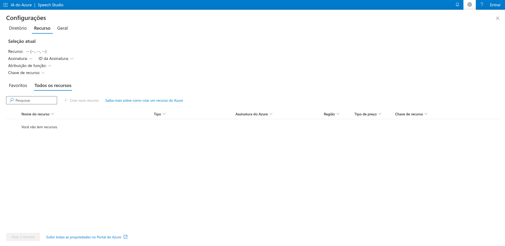

# DesafioAn-liseSentimentos

# Speech Studio

Speech Studio é uma plataforma da Microsoft que permite testar e implementar serviços de reconhecimento de fala e conversão de texto em fala. Ele fornece ferramentas para transcrição de áudio, criação de modelos personalizados de voz e análise de sentimentos a partir da fala.

## Recursos Principais

- **Conversão de Fala para Texto**: Transcreva áudios em tempo real ou arquivos gravados.
- **Conversão de Texto para Fala**: Gere vozes sintéticas naturais a partir de textos.
- **Tradução de Fala**: Converta fala em diferentes idiomas automaticamente.
- **Modelos Personalizados**: Treine modelos para reconhecimento de vocabulário específico.
- **Análise de Sentimentos na Fala**: Extraia emoções e tons de voz dos áudios.

## Como Usar

1. **Acesse o Speech Studio**: Faça login no [Speech Studio](https://speech.microsoft.com/).
2. **Escolha um serviço**: Selecione entre os módulos disponíveis.
3. **Configure seu projeto**: Carregue áudios, treine modelos e ajuste parâmetros.
4. **Teste e implemente**: Utilize a API do Azure para integrar com seus aplicativos.

## Imagens

### Interface Principal


### Configuração de Conversão de Texto para Fala


### Análise de Sentimento


## Integração com API do Azure

Para integrar o Speech Studio ao seu projeto, utilize a API do Azure. Exemplo de chamada para transcrição de áudio:

```python
import azure.cognitiveservices.speech as speechsdk

speech_key = "YOUR_SPEECH_KEY"
service_region = "YOUR_SERVICE_REGION"

speech_config = speechsdk.SpeechConfig(subscription=speech_key, region=service_region)
audio_config = speechsdk.AudioConfig(filename="audio.wav")

speech_recognizer = speechsdk.SpeechRecognizer(speech_config=speech_config, audio_config=audio_config)
result = speech_recognizer.recognize_once()

print("Texto transcrito:", result.text)
```

## Conclusão

O Speech Studio é uma ferramenta poderosa para projetos de processamento de áudio e inteligência artificial aplicada à fala. Ele permite experimentação rápida e implementação robusta de soluções baseadas em voz.

Para mais informações, acesse a [documentação oficial](https://learn.microsoft.com/en-us/azure/cognitive-services/speech-service/).
